### Whiteboard Images

### Challenge A: Array Reversal
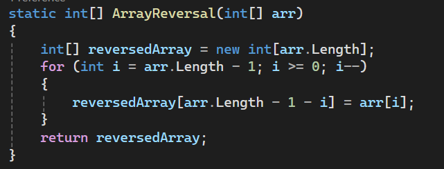

### Challenge B: Most Frequent Number
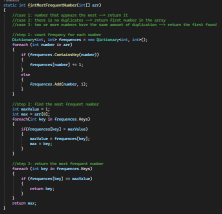

### Challenge 02: Maximum Value
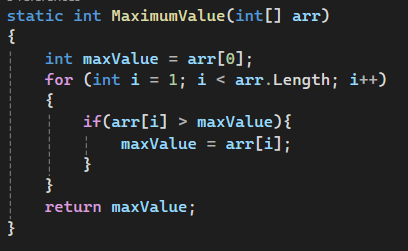

### Challenge 03: Remove Middle Value
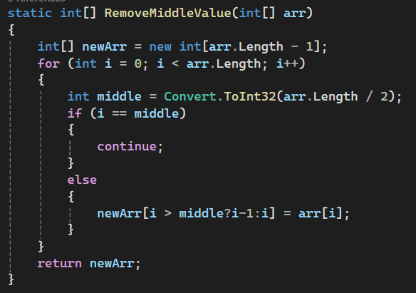

### Challenge 04: Insert Middle Value
 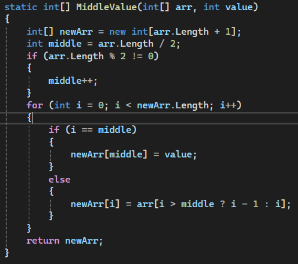

### Challenge 05: Find-Duplicates
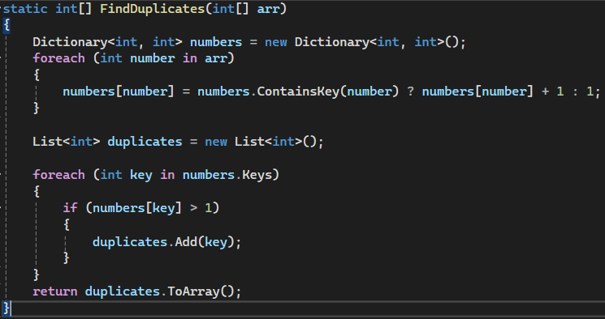

### Challenge 06-A: Common Elements
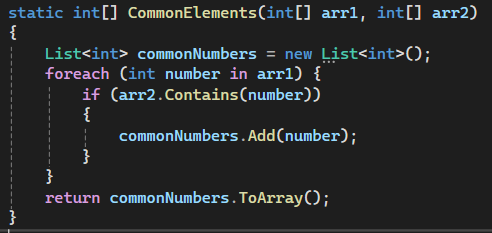

### Challenge 06-B: Reverse Words
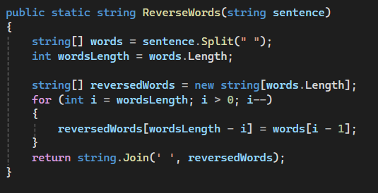

### Linked List Implementation
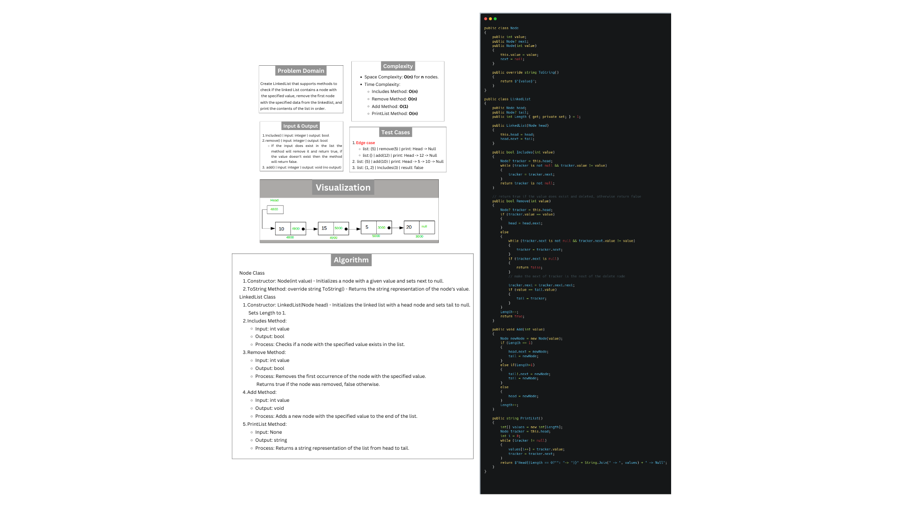

### Linked List Remove Duplicates
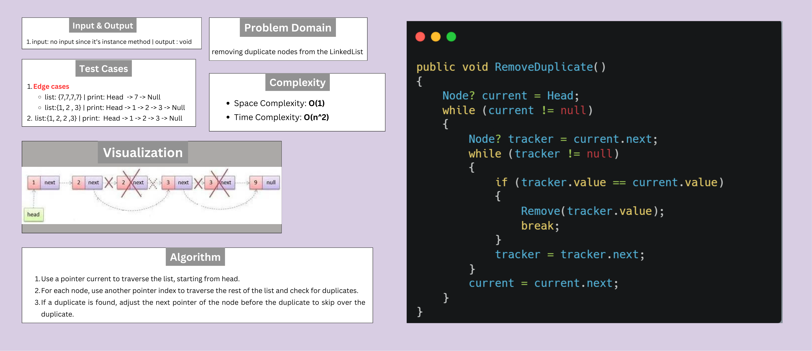

### Linked List Merge Sorted Lists
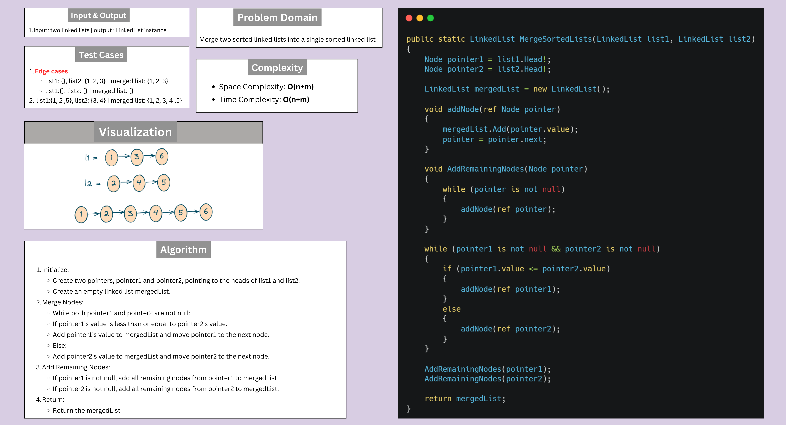

### Stack & Queue Implementation
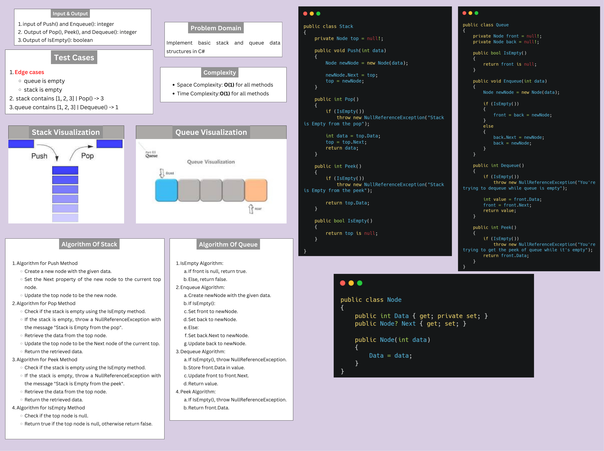

### Reverse a Stack using Queue
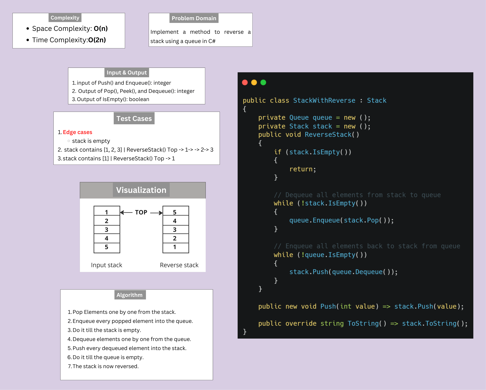
